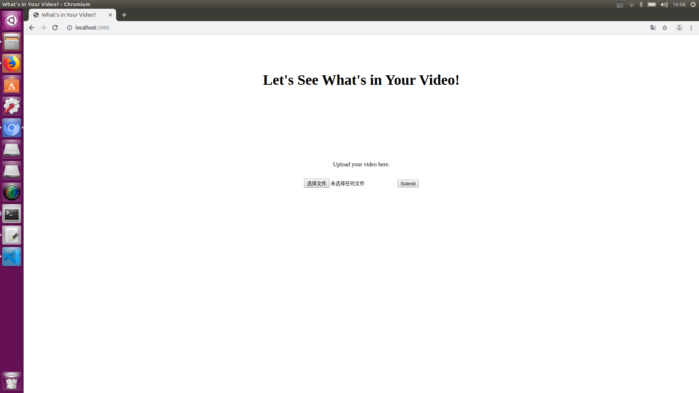

# Big Data Project

### Demo


### Project Structure

```
├── app
│   ├── app.py
│   ├── detect.py
│   ├── static
│   │   └── style.css
│   └── templates
│       ├── detect_result.html
│       └── index.html
├── darknet
│   ├── coco.names
│   ├── data
│   └── yolov3.cfg
├── Dockerfile
└── requirements.txt
```


### Installation

**Prerequisite**

Make sure docker is already installed.

**Setting up Cassandra**

First you have to create a specific network for cassandra to work in.

Run `docker network create --driver=bridge --subnet=172.18.0.0/16 mynetwork` , where `172.18.0.0` is the IP address of your network and `mynetwork` is the name of your network. These two can be replaced as you like.

As the network has already been created, now you can pull the cassandra image and run it.

Run `docker run --name mydb --network mynetwork --ip 172.18.0.3 -p 9042:9042 -d cassandra:latest`. `mydb` is the name you assigned to your database, `mynetwork` is the name of the network you just created, `172.18.0.3` is the ip address of the network, where we altered the specific address for cassandra to use.

**Setting up the main program**

First you have to download the weights file of yolo. I downloaded it [here](https://pjreddie.com/media/files/yolov3.weights). Put it in a place where you can remember, and we are going to use it later.

As the main program has been dockerized and published, you can simply run `docker run -it --name big-data-project --network mynetwork -p 5000:5000 gary98742/big-data-project:latest`, where `big-data-project` is the name of your project and `mynetwork` is the name of your network.

If you see something in the console like `Running on http://0.0.0.0:5000/`, that means the project has been properly set up in your computer, and now you can open a browser and type `0.0.0.0:5000` and you can see the main page of the website.

<<<<<<< HEAD

=======
</img>
>>>>>>> 29d32aea6c3bee9008641013a1714448c8bf89d3


**Upload the weights file**

As a volume has already been created within the Dockerfile, now we can specifically find where the volume locates on your host computer and we can copy and paste the weights file we downloaded to the volume location so that the weights file can be uploaded to docker container. 

In order to checkout where the volume locates in our host computer, you can run `docker inspect -f {{.Mounts}} big-data-project`. The console should output something like `[{volume 62c8cb5932e7d72d4d3541638113f65a32378bc88369c3d67c9900636be496cd /var/lib/docker/volumes/62c8cb5932e7d72d4d3541638113f65a32378bc88369c3d67c9900636be496cd/_data /app/darknet local  true }]`. 

Open console in the root of your weights file, and run `sudo cp -R yolov3.weights /var/lib/docker/volumes/62c8cb5932e7d72d4d3541638113f65a32378bc88369c3d67c9900636be496cd/_data`, this will copy the weights file to the volume folder and thus upload to docker container.

**Run the program**

Open the browser, click the `choose file` button, and choose a video you want to upload, then click the submit button. The program will start to analyze the video you uploaded.

After a while, the page will be directed to a result page where the video you uploaded has been analyzed and displayed.

**Check out Cassandra**

After the steps above, the video you uploaded has already been analyzed and the information has been stored in cassandra. You can use cqlsh to query the data.

Open a terminal and run `docker exec -it mydb cqlsh`. The console will show you the cqlsh command line. Then run `use myspace;` to assign the key space and run `select * from objects;` to query the data. Then you can see the objects that has been detected in your video.


### Contact information

**Email**: 987420788yh@gmail.com

